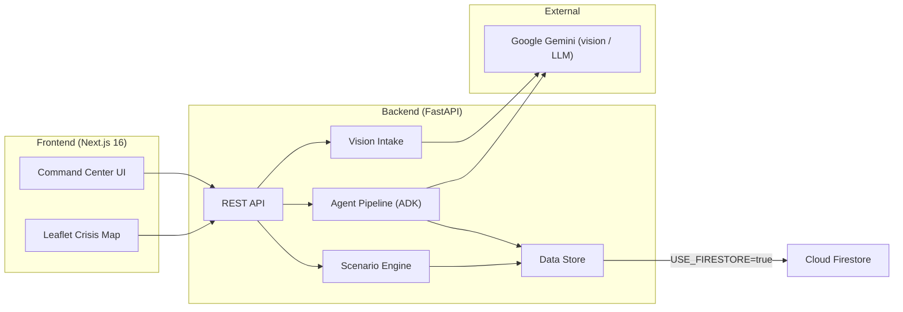

# NEXUS — Crisis Decision Support System

AI-assisted command center for emergency response. NEXUS combines an
interactive operational map, a multi-agent analysis pipeline, a
"what if?" scenario engine, and Gemini-powered image intake to help
operators make faster, better-informed crisis decisions.

Built for a hackathon — mock-first architecture so the whole system runs
locally with zero external dependencies, and drops onto Google Cloud
Firestore with a single env flag.

## Features

| Phase | Feature | Status |
| ----- | ------- | ------ |
| 1 | Setup, FastAPI + Next.js scaffold, mock data store | ✅ |
| 2 | Multi-agent analysis pipeline (research → risk → geospatial → resource → coordinator → decision → simulation) | ✅ |
| 3 | Command center: map, risk panel, resource panel, activity stream, Plan A/B/C recommendation cards | ✅ |
| 4 | Scenario engine: "what if?" presets, state mutation, risk recalculation, 7th Simulation agent | ✅ |
| 5 | Multimodal: image upload, Gemini vision extraction, structured incident intake, map update | ✅ |
| 6 | Polish: animations, skeletons, agent traces, error handling, demo reset, deployment | ✅ |
| 7 | Response plans: Plan A/B/C options, confidence scores, human approval workflow, weather + field-report signals | ✅ |
| 8 | Real data: 3,660 historic monsoon weather records (Open-Meteo) + 198 Bengaluru ward census records | ✅ |

## Architecture



**Data flow**

1. The command center polls the REST API for incidents, zones, roads and
   resources (4s interval).
2. Operators select an incident and run the **agent pipeline** — ADK
   workflows produce a risk assessment, resource summary and **three
   response plans (A: Evacuation First, B: Infrastructure First,
   C: Balanced, recommended)**, each with confidence scores. Approving a
   plan writes it to the `plans` collection and logs an OPERATOR activity.
3. The **scenario engine** snapshots the live store, applies "what if?"
   mutations (flood rise, road closure, hospital overload, population
   influx) against an isolated copy, recomputes the risk score for a
   before/after comparison, and runs the **Simulation agent** as a 7th
   ADK workflow step.
4. The **vision intake** accepts a field image, sends it to Gemini for
   structured incident extraction, and creates a new incident — which the
   map picks up on the next poll.
5. **Weather events**, **incident reports** and **ward census records** in
   the seed data feed the Research agent's signal count and population
   exposure estimates.

## Repository layout

```
.
├── backend/            FastAPI service
│   ├── app/
│   │   ├── agents/     ADK agent pipeline (llm, tools, workflow, service)
│   │   ├── api/        REST routers (crud, scenarios, vision, plans)
│   │   ├── data/       Synthetic seed data + generated real_data.py
│   │   ├── models/     Pydantic schemas
│   │   ├── scenarios/  "What if?" engine + presets
│   │   ├── scripts/    fetch_real_data.py (one-time data generator)
│   │   ├── services/   Firestore / mock data layer
│   │   └── vision/     Gemini image extraction
│   ├── tests/          pytest suite
│   ├── Dockerfile      Render container (installs deps, starts uvicorn)
│   ├── Procfile        Bare-metal uvicorn start command (Python runtime)
│   └── seed_firestore.py
└── frontend/           Next.js 16 command center
    ├── app/            Routes + layout
    ├── components/
    │   ├── dashboard/  Panels, trace, scenario builder, vision intake
    │   ├── map/        Leaflet crisis map
    │   └── ui/         Skeleton, Toast
    ├── lib/api.ts      Typed API client
    └── types/nexus.ts  Shared types
```

## Local development

### Backend

```bash
cd backend
python -m venv .venv
.venv\Scripts\activate        # Windows
source .venv/bin/activate     # macOS / Linux
pip install -r requirements.txt

# optional: set keys (see "Environment variables")
copy .env.example .env

uvicorn app.main:app --reload
```

> Use the project's virtualenv Python — `google.adk` and the other
> dependencies are installed there, not in your global Python.
> A helper that does this for you: `.\backend\start.ps1` (Windows,
> use `.venv\Scripts\python.exe -m uvicorn app.main:app` otherwise).

Backend runs at `http://localhost:8000`. API docs at
`http://localhost:8000/docs`.

### Frontend

```bash
cd frontend
npm install
npm run dev
```

Frontend runs at `http://localhost:3000`. `NEXT_PUBLIC_API_URL`
defaults to `http://localhost:8000`.

The frontend is a multi-page app (App Router). Use the top nav bar
to switch pages:

| Route | Page |
|---|---|
| `/` | Command Center: incident list + map + risk/details rail |
| `/resources` | Teams, vehicles, shelters, hospitals, supplies |
| `/analysis` | Agent pipeline, response plans (A/B/C), trace |
| `/activity` | System activity feed |
| `/scenarios` | "What if" simulation presets and comparisons |
| `/vision` | Image intake (Gemini extraction) |
| `/weather` | Real rainfall history, field reports, ward census |

### Tests

```bash
cd backend
pytest            # 51 tests
cd ../frontend
npm run lint
npm run build
```

## Environment variables

### Backend (`backend/.env`)

| Variable | Default | Description |
| -------- | ------- | ----------- |
| `USE_FIRESTORE` | `false` | `true` uses Cloud Firestore, `false` uses the in-memory mock store |
| `GOOGLE_API_KEY` | | Gemini API key (vision + LLM mode) |
| `AGENT_LLM_MODE` | `deterministic` | `deterministic` uses MockLlm; `llm` uses Gemini |
| `AGENT_MODEL` | `gemini-3.5-flash` | Agent pipeline model |
| `VISION_MODE` | `llm` | `llm` uses Gemini vision; `deterministic` uses the offline template |
| `VISION_MODEL` | `gemini-3.5-flash` | Vision model |
| `FRONTEND_URL` | `http://localhost:3000` | CORS allow-list |

### Frontend (`frontend/.env.local`)

| Variable | Default | Description |
| -------- | ------- | ----------- |
| `NEXT_PUBLIC_API_URL` | `http://localhost:8000` | Backend base URL |

## API overview

| Method | Endpoint | Description |
| ------ | -------- | ----------- |
| GET | `/health` | Health check |
| GET/POST | `/incidents` | List / create incidents |
| GET/PATCH/DELETE | `/incidents/{id}` | Read / update / delete an incident |
| GET | `/zones`, `/roads`, `/shelters`, `/hospitals`, `/teams`, `/vehicles`, `/supplies` | Static operational data |
| GET | `/weather` | Weather events (`zone`, `limit`, `date` filters) |
| GET | `/reports` | Field reports |
| GET | `/wards` | Bengaluru ward census records (`zone`, `limit` filters) |
| GET | `/activity` | Full activity feed |
| POST | `/agents/analyze/{incident_id}` | Run the agent pipeline |
| GET | `/agents/activity` | Agent-only activity feed |
| GET | `/scenarios/presets` | "What if?" preset templates |
| POST/GET | `/scenarios` | Create (runs the scenario) / list |
| GET/DELETE | `/scenarios/{id}` | Read / delete a scenario |
| POST | `/incidents/{id}/plans/{plan_id}/approve` | Approve a response plan |
| GET | `/plans` | List approved plans |
| POST | `/vision/extract` | Multipart image upload → Gemini extraction |
| POST | `/reset` | Reset demo data to the seed |

## Real data

NEXUS ships with ~4,000 documents of real public data (~9.9 MB) used by the
Research agent and the reporting endpoints. Both datasets are committed to
the repo so the app runs fully offline.

| Dataset | Count | Source | License |
| ------- | ----- | ------ | ------- |
| `weather_events` — daily monsoon rainfall (Jun–Sep 1994–2023) for Bengaluru with hourly precipitation/temperature/humidity/wind/pressure breakdowns, mapped to the demo zones | 3,660 | Open-Meteo Archive API | CC BY 4.0 (free for non-commercial use) — https://open-meteo.com/ |
| `wards` — BBMP ward-wise population, literacy and sex ratio | 198 | Census of India 2011 (via censusindia2011.com / opencity.in) | Public domain |

Attribution for the weather data is required under CC BY 4.0 wherever it is
displayed. The data lives in `backend/app/data/real_data.py` and can be
regenerated with `python scripts/fetch_real_data.py` (network required).

## Submission package

Judging materials for the hackathon submission live in `docs/`:

- **Text description** — `docs/submission-description.md`
- **Architecture diagram** — `docs/architecture.svg` (rendered PNG:
  `docs/architecture.png`)

## Deployment

This app runs live, front-to-back, without an account with a billing card:
the FastAPI backend on **Render** (free web service) and the Next.js
frontend on **Vercel** (free Hobby plan). Firestore is used as the real
persistent store, with an automatic fallback to a lightweight in-memory
dataset when the free-tier quota is exhausted.

Live URLs:
- Backend: `https://nexus-backend-o959.onrender.com`
- Frontend: `https://nexus-nu-pied.vercel.app`

### Backend on Render (Docker runtime)

1. Push the repo to GitHub (default branch `main`).
2. In Render, **New + → Web Service**, connect the repo.
3. Root directory: `backend`
4. Runtime: **Docker** (Render builds the committed `Dockerfile`, which
   installs `requirements.txt` and starts uvicorn on `$PORT`).
5. Environment:
   - `USE_FIRESTORE=true`
   - `GOOGLE_APPLICATION_CREDENTIALS_JSON` = full Firebase admin service-account
     JSON (without credentials the app runs on the in-memory store; on quota
     exhaustion it falls back to the compact `lite_data` seed)
   - `AGENT_LLM_MODE=deterministic` (or `llm` to use the Gemini agent)
   - `VISION_MODE=llm`
   - `GOOGLE_API_KEY` = Gemini API key
6. Render auto-builds on every push to `main`.

> **Note on runtime choice.** The service was created with the Docker
> runtime, which is what the committed `Dockerfile` drives. If you prefer a
> plain Python deployment (no containers), recreate the web service with
> Runtime **Python 3**, build `pip install -r requirements.txt`, and start
> `uvicorn app.main:app --host 0.0.0.0 --port ${PORT:-8000}` — the app is
> container-agnostic and both paths work identically.

### Frontend on Vercel

1. In Vercel, **New Project** from the same repo.
2. Root directory: `frontend`, framework Next.js.
3. `NEXT_PUBLIC_API_URL` = `https://nexus-backend-o959.onrender.com`
   (the code also defaults to this URL, so it works even if unset).
4. The frontend runs entirely client-side in the browser and calls the
   backend with no credentials, so the backend's CORS policy
   (`allow_origins=["*"]`) permits any origin.

## Build notes & learnings

- **Scope discipline beats scope.** The most valuable decision was making
  data deterministic and the agent pipeline offline-capable first, then
  layering Gemini on top. Every part of the demo works with zero external
  dependencies, which made development and the live demo resilient.
- **Separate computation from reasoning.** Operational facts (risk scores,
  population exposure, road constraints) are computed by deterministic
  tool functions; Gemini/ADK agents reason over those facts and explain
  trade-offs. Human approval gates consequential actions — a cleaner
  trust story for a crisis system.
- **ADK workflows as the orchestration contract.** Running the pipeline
  through `google.adk.runners.Runner` (async event stream) made the agent
  chain testable and gave the UI a natural live-progress feed for free.
- **Mock-first persistence is a demo superpower.** The same store layer
  backs the in-memory mode and Cloud Firestore; switching is one env flag,
  and seeding persists ~4,000 real records for consistency across reviews.
- **Degrade, don't crash.** The data layer applies server-side query
  limits so reads stay inside the free-tier budget, and — when the
  Firestore Spark quota is momentarily exhausted — it falls back to a
  compact in-memory seed (`app.data.lite_data`) instead of failing. A
  demo that keeps serving under an operational limit is worth more than
  one that returns 500s mid-walkthrough.
- **Disclosure:** NEXUS was built from scratch during the submission
  period. AI coding assistants were used to write and debug code; no
  pre-existing application code, frameworks beyond those listed under
  "Local development", or third-party assets were incorporated other than
  the publicly licensed weather and census datasets documented above.

## Notes

- The mock store is in-memory and resets on restart; use the **Reset demo
  data** button in the header to reseed at any time.
- When Firestore's free-tier read quota is exhausted for the day, the app
  transparently serves a compact in-memory dataset (`lite_data`: 343 docs,
  few MB) so the demo keeps working; it returns to real Firestore
  persistence once quota is available again.
- In Firestore mode (`USE_FIRESTORE=true`), seed once with
  `python seed_firestore.py` (pass the admin JSON via
  `GOOGLE_APPLICATION_CREDENTIALS` or `--credentials PATH`).
  The ~4,000 documents (~9.9 MB) sit comfortably inside the Firestore Spark
  free tier (1 GiB stored data; one-time seed ≈ 19% of the 20K/day write
  quota).
- Scenario runs are fully isolated — mutations never touch live data.
- Approved plans are cleared by the demo reset, so a fresh demo always
  starts from a clean slate.
- `GET /weather` returns the most recent 100 records by default; pass
  `limit` up to 10,000 and/or a `zone` to slice the full history.
